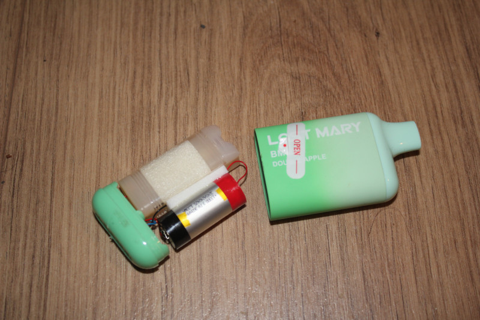
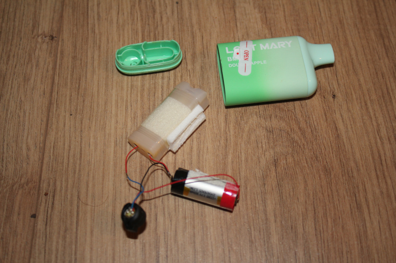
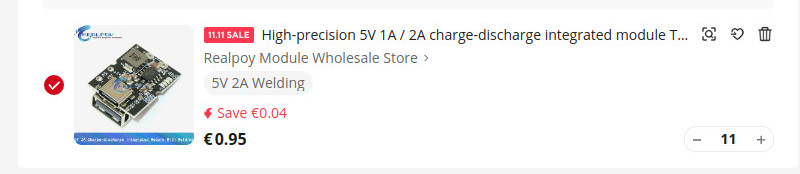
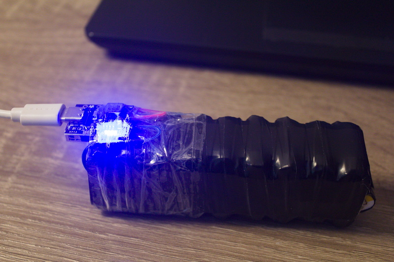
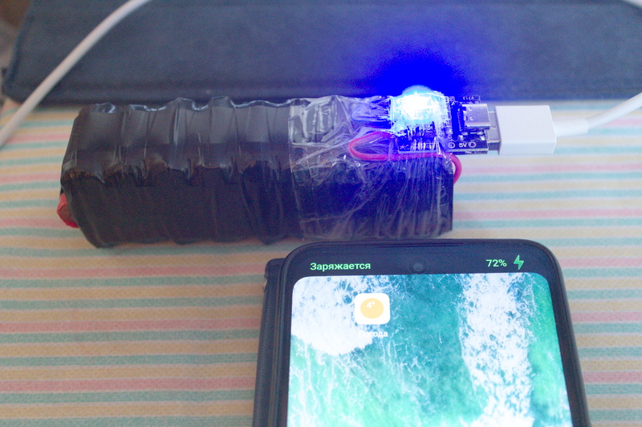

# OneEuroPower
## how to build power bank from vape batteries

So we have 27 used vapes. This will give us in total 27x360=9720mAh.

Carefully disassemble the vape. Remove the bottom cover with pliers. Take out the contents and disconnect the battery.

Place batteries side by side with the positive terminal right side up on one battery and the negative terminal right side up on the other. Use electrical tape around the middle of the batteries to secure them together.

Connect the batteries in parallel

Connect the charging module

charging

discharging

Now we have a power bank for 1 euro!

### We are amazing!

